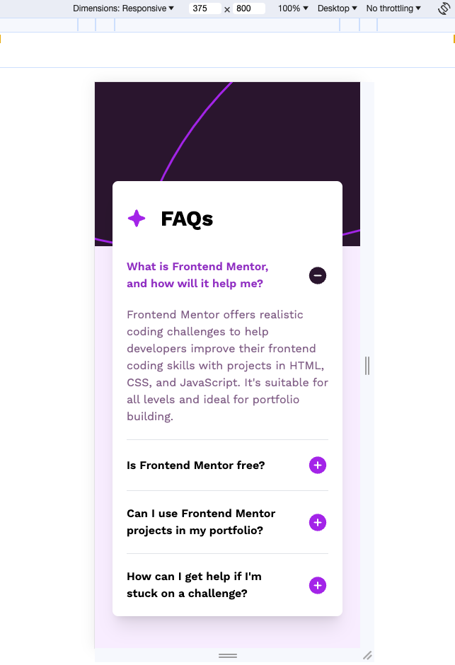
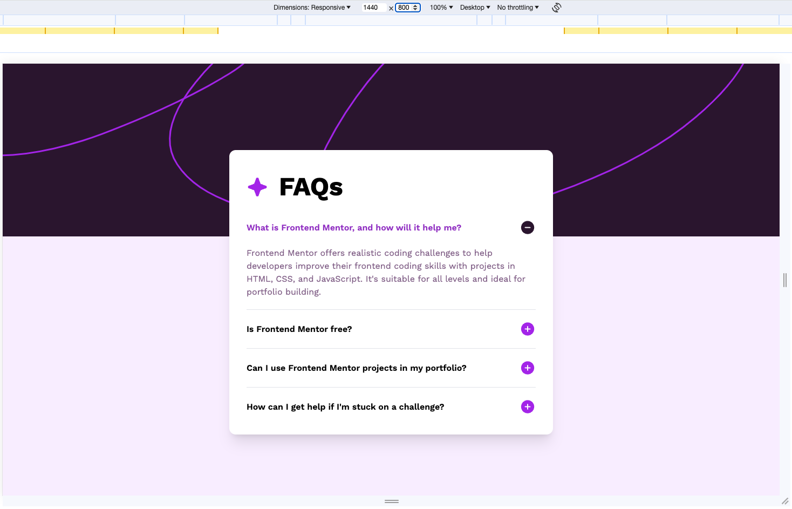

# Frontend Mentor - FAQ accordion solution

This is a solution to the [FAQ accordion challenge on Frontend Mentor](https://www.frontendmentor.io/challenges/faq-accordion-wyfFdeBwBz). Frontend Mentor challenges help you improve your coding skills by building realistic projects.

## Table of contents

- [Overview](#overview)
  - [The challenge](#the-challenge)
  - [Screenshot](#screenshot)
  - [Links](#links)
- [My process](#my-process)
  - [Built with](#built-with)
  - [What I learned](#what-i-learned)
- [Author](#author)

## Overview

### The challenge

Users should be able to:

- Hide/Show the answer to a question when the question is clicked
- Navigate the questions and hide/show answers using keyboard navigation alone
- View the optimal layout for the interface depending on their device's screen size
- See hover and focus states for all interactive elements on the page

### Screenshot

- Mobile
  

- Desktop
  

### Links

- Solution URL: [Add solution URL here](https://your-solution-url.com)
- Live Site URL: [Add live site URL here](https://your-live-site-url.com)

## My process

### Built with

- Semantic HTML5 markup
- Mobile-first workflow
- [React](https://reactjs.org/) - JS library
- [TailwindCSS](https://tailwindcss.com/) - For styles

### What I learned

- Setting an element as tabbable using `tabIndex={0}`, taking it out of the flow with `tabIndex={-1}`
- Setting an event handler for `onKeyDown` in JSX to trigger a setter function via the Spacebar key and the event's typing

```jsx
const handleKeyPress = (event: React.KeyboardEvent<HTMLDivElement>) => {
  if (event.key === " " || event.key === "Spacebar") {
    setIsOpen(!isOpen);
  }
};

// ...

<div tabIndex={0} onKeyDown={handleKeyPress}></div>;
```

- Setting up locally stored `.ttf` files for tailwind

```css
@layer base {
  @font-face {
    font-family: WorkSans;
    src: url("./src/assets/fonts/static/WorkSans-Regular.ttf") format("truetype");
    font-weight: 400;
    font-style: normal;
  }
  @font-face {
    font-family: WorkSans;
    src: url("./src/assets/fonts/static/WorkSans-SemiBold.ttf") format("truetype");
    font-weight: 600;
    font-style: normal;
  }
  @font-face {
    font-family: WorkSans;
    src: url("./src/assets/fonts/static/WorkSans-Bold.ttf") format("truetype");
    font-weight: 700;
    font-style: normal;
  }
}
```

- Making a more generic component that can be reused depending on the props passed in
```jsx
const Accordion = ({ title, items }: IAccordionProps) => {...};

const AccordionTitle = ({
  title,
  icon,
}: {
  title: string;
  icon?: ReactNode;
}) => {...};

const AccordionItems: React.FC<IAccordionItems> = ({ items }) => {...};

const AccordionItem = ({ id, title, description }: IAccordionItem) => {...};
```


- Setting `mb-auto` and `mt-[140px]` to flush the accordion to the top, causing expanded items to shift the element down rather than re-adjusting both top and bottom if `flex` + `align-items: center` was used + Using `mx-auto` instead of `justify-content: center`

```jsx
<main className="... mb-auto mx-auto mt-[140px] sm:mt-[160px] ..."></main>
```

## Author

- Website - [Brennan](https://btjl.vercel.app/)
- Frontend Mentor - [@btjl](https://www.frontendmentor.io/profile/btjl)
